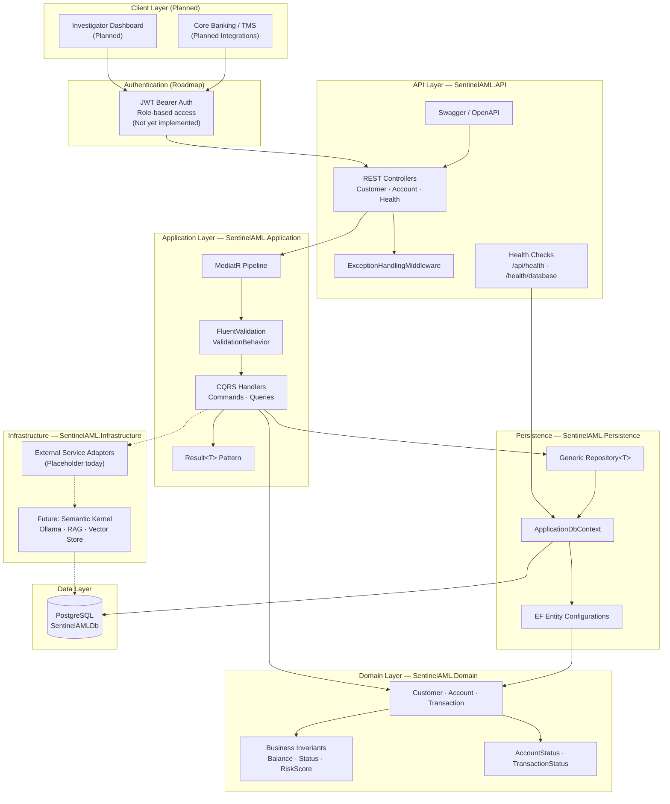
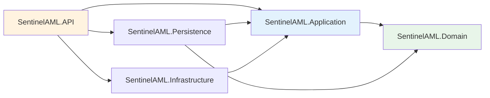

# Architecture Diagram

High-level system architecture for SentinelAML, derived from the current solution structure and planned components.

## System Context



## Request Flow (Command Example)

```mermaid
sequenceDiagram
    participant Client
    participant Controller as AccountController
    participant MediatR
    participant Validator as FluentValidation
    participant Handler as CreateAccountCommandHandler
    participant Repo as IRepository
    participant UoW as IUnitOfWork
    participant DB as PostgreSQL

    Client->>Controller: POST /api/accounts
    Controller->>MediatR: CreateAccountCommand
    MediatR->>Validator: ValidationBehavior
    alt Validation fails
        Validator-->>Controller: ValidationException → 400
    end
    Validator->>Handler: Handle command
    Handler->>Repo: GetByIdAsync(Customer)
    Handler->>Repo: FindAsync(AccountNumber)
    Handler->>Repo: AddAsync(Account)
    Handler->>UoW: SaveChangesAsync()
    UoW->>DB: INSERT accounts
    Handler-->>Controller: Result&lt;Guid&gt;
    Controller-->>Client: 201 Created
```

## Layer Dependency Rules



The Domain layer has **zero dependencies** on frameworks. All EF Core and HTTP concerns remain in outer layers.
