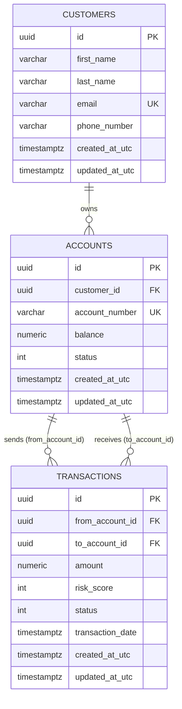

# Database Design

Database schema documentation derived from `SentinelAML.Domain` entities and `SentinelAML.Persistence/Data/Configurations`.

**Database engine:** PostgreSQL  
**ORM:** Entity Framework Core 9 (Npgsql provider)  
**DbContext:** `ApplicationDbContext`

---

## Schema Overview

Three tables are configured today. All share a common base entity pattern with UUID primary keys and UTC audit timestamps.

| Table | Domain entity | Business purpose |
|-------|---------------|------------------|
| `customers` | `Customer` | Subject of investigation — identity and contact profile |
| `accounts` | `Account` | Financial accounts linked to customers; balance and lifecycle status |
| `transactions` | `Transaction` | Fund movements between accounts; risk score and processing status |

> **Note:** The `transactions` table is mapped in EF Core but has no application handlers or API endpoints yet. It exists to support the transaction monitoring roadmap.

---

## Base Entity Pattern

All entities inherit from `BaseEntity`:

| Column | Type | Constraints | Purpose |
|--------|------|-------------|---------|
| `id` | `uuid` | PK, not auto-generated | Globally unique identifier (set in domain) |
| `created_at_utc` | `timestamptz` | NOT NULL | Record creation audit |
| `updated_at_utc` | `timestamptz` | NULL | Last mutation audit |

---

## Entity: `customers`

**Domain class:** `Customer`  
**Business purpose:** Represents an individual or party under investigation. Root aggregate for account ownership in the domain model.

### Columns

| Column | Property | Type | Constraints | Description |
|--------|----------|------|-------------|-------------|
| `id` | `Id` | `uuid` | PK | Customer identifier |
| `first_name` | `FirstName` | `varchar(100)` | NOT NULL | Given name |
| `last_name` | `LastName` | `varchar(100)` | NOT NULL | Family name |
| `email` | `Email` | `varchar(255)` | NOT NULL, UNIQUE | Contact email; deduplication key |
| `phone_number` | `PhoneNumber` | `varchar(20)` | NOT NULL | Contact phone |
| `created_at_utc` | `CreatedAtUtc` | `timestamptz` | NOT NULL | Created timestamp |
| `updated_at_utc` | `UpdatedAtUtc` | `timestamptz` | NULL | Updated timestamp |

### Indexes

- **Unique:** `email` — enforced at DB and application layer (`CreateCustomerCommandHandler`)

### Domain rules

- Profile fields required and trimmed via `UpdateProfile()`
- `OpenAccount(accountNumber, initialBalance)` factory method on aggregate (application currently uses `Account.Create` directly — see system design)

### Relationships

- **One-to-many** → `accounts` (FK: `accounts.customer_id`)

---

## Entity: `accounts`

**Domain class:** `Account`  
**Business purpose:** Bank-style account linked to a customer. Tracks balance and operational status for investigation context and future transaction monitoring.

### Columns

| Column | Property | Type | Constraints | Description |
|--------|----------|------|-------------|-------------|
| `id` | `Id` | `uuid` | PK | Account identifier |
| `customer_id` | `CustomerId` | `uuid` | NOT NULL, FK | Owning customer |
| `account_number` | `AccountNumber` | `varchar(50)` | NOT NULL, UNIQUE | External account reference |
| `balance` | `Balance` | `numeric(18,2)` | NOT NULL | Current balance |
| `status` | `Status` | `integer` | NOT NULL | Enum: Active(0), Suspended(1), Closed(2) |
| `created_at_utc` | `CreatedAtUtc` | `timestamptz` | NOT NULL | Created timestamp |
| `updated_at_utc` | `UpdatedAtUtc` | `timestamptz` | NULL | Updated timestamp |

### Indexes

- **Unique:** `account_number`

### Domain rules

| Method | Rule |
|--------|------|
| `Credit(amount)` | Active account only; amount > 0 |
| `Debit(amount)` | Active account only; sufficient balance |
| `Close()` | Balance must be zero; idempotent if already closed |
| `Suspend()` / `Activate()` | Status transitions with closed-account guard |

### Relationships

| Relationship | FK | Delete behavior |
|--------------|-----|-----------------|
| Customer → Account | `customer_id` → `customers.id` | RESTRICT |
| Account → Transaction (outgoing) | `transactions.from_account_id` | RESTRICT |
| Account → Transaction (incoming) | `transactions.to_account_id` | RESTRICT |

---

## Entity: `transactions`

**Domain class:** `Transaction`  
**Business purpose:** Records fund transfer between two accounts. Designed for AML transaction monitoring with embedded risk scoring and status lifecycle.

### Columns

| Column | Property | Type | Constraints | Description |
|--------|----------|------|-------------|-------------|
| `id` | `Id` | `uuid` | PK | Transaction identifier |
| `from_account_id` | `FromAccountId` | `uuid` | NOT NULL, FK | Source account |
| `to_account_id` | `ToAccountId` | `uuid` | NOT NULL, FK | Destination account |
| `amount` | `Amount` | `numeric(18,2)` | NOT NULL | Transfer amount |
| `risk_score` | `RiskScore` | `integer` | NOT NULL, default 0 | Fraud/AML risk score (0+) |
| `status` | `Status` | `integer` | NOT NULL | Pending(0), Completed(1), Failed(2) |
| `transaction_date` | `TransactionDate` | `timestamptz` | NOT NULL | Business event timestamp |
| `created_at_utc` | `CreatedAtUtc` | `timestamptz` | NOT NULL | Record creation |
| `updated_at_utc` | `UpdatedAtUtc` | `timestamptz` | NULL | Last update |

### Domain rules

| Rule | Implementation |
|------|----------------|
| No self-transfer | `fromAccount.Id != toAccount.Id` |
| Positive amount | `amount > 0` |
| Lifecycle | `Complete(riskScore)` or `Fail()` from Pending only |
| Risk score | Non-negative integer set on completion |

### Relationships

| FK | References | Purpose |
|----|------------|---------|
| `from_account_id` | `accounts.id` | Debit source |
| `to_account_id` | `accounts.id` | Credit destination |

---

## Entity Relationship Diagram



---

## Referential Integrity

All foreign keys use **`ON DELETE RESTRICT`**:

- Prevents accidental deletion of customers with open accounts
- Prevents deletion of accounts referenced by transactions
- Aligns with financial audit requirements — records should be closed/archived, not hard-deleted

---

## Enum Mappings

Stored as integers in PostgreSQL:

### `AccountStatus`

| Value | Name |
|-------|------|
| 0 | Active |
| 1 | Suspended |
| 2 | Closed |

### `TransactionStatus`

| Value | Name |
|-------|------|
| 0 | Pending |
| 1 | Completed |
| 2 | Failed |

---

## DbContext Registration

```csharp
public DbSet<Customer> Customers => Set<Customer>();
public DbSet<Account> Accounts => Set<Account>();
public DbSet<Transaction> Transactions => Set<Transaction>();
```

Configurations applied via `ApplyConfigurationsFromAssembly` from `SentinelAML.Persistence`.

---

## Migration & Deployment Notes

- Migrations are **not committed** to the repository (see `.gitignore`)
- Generate locally:

```bash
dotnet ef migrations add InitialCreate \
  --project src/SentinelAML.Persistence \
  --startup-project src/SentinelAML.API

dotnet ef database update \
  --project src/SentinelAML.Persistence \
  --startup-project src/SentinelAML.API
```

- Production recommendation: commit migrations or use a managed schema deployment pipeline before go-live

---

## Planned Schema Extensions

| Table | Purpose |
|-------|---------|
| `investigation_cases` | Case workflow, assignment, status |
| `case_notes` | Analyst notes and AI-generated drafts |
| `risk_rules` | Configurable fraud/AML rule definitions |
| `audit_events` | Immutable mutation log |
| `users` / `roles` | Identity for JWT authorization |

---

## Related Documents

- [System Design](system-design.md)
- [API Specification](api-specification.md)
